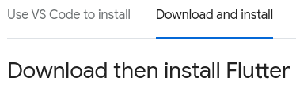
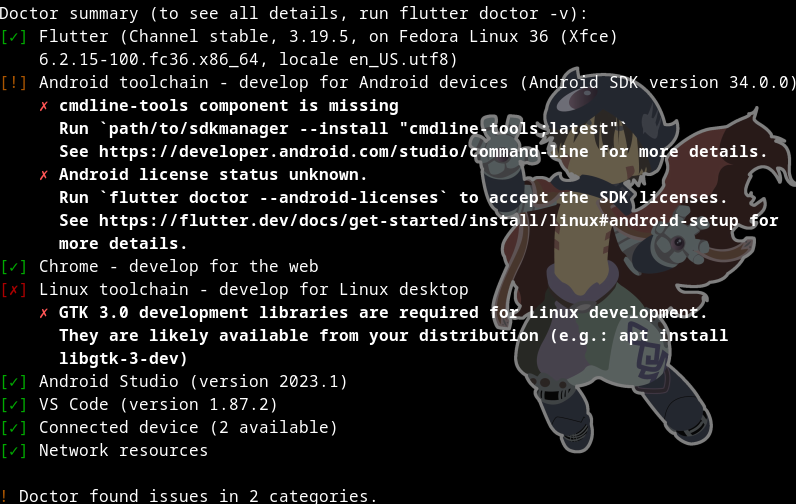

# Workshop Flutter

## Develop an Android app with Flutter

Hello,

Welcome to this Flutter workshop. Today you will learn how to create your own Android app with Flutter.

## What is Flutter?

Flutter is a framework using the programming language Dart to build front side applications.

[Dart documentation to understand the basics](https://dart.dev/language)

The language is very similare to C and Python so you shouldn't feel lost, however, if you have issues with the language itself, even after checking the link above, don't hesitate to call the organisers for help!

## Setup Flutter on your machine

First, go to [this link](https://docs.flutter.dev/get-started/install) and follow the instructions to download Flutter on your machine for **VS Code**, it will be easier to use than Android Studio.<br/>
If you already have Android Studio installed, it's better to use it, just follow the instructions in the documentation for informations on how to setup and launch a new project in Flutter.

Assuming you are using a Linux OS, you can set it up like so:

### 1. Mandatory files
- Make sure those packages are installed on your machine: **curl**, **git**, **unzip**, **xz-utils**, **zip**, **libglu1-mesa**<br/>
(if you're using the OS version given by EPITECH, they are already installed)
```sh
sudo apt-get update -y && sudo apt-get upgrade -y;
sudo apt-get install -y curl git unzip xz-utils zip libglu1-mesa
```

### 2. Install Flutter
- Go to the tab **Download and install**<br/>
<br/>
- Then click the download button to install Flutter zipped file.<br/>
- Create a folder where you can install Flutter, best place to do it is `/usr/bin/`
- Extract the file into the directory with the following command:
```sh
sudo tar -xf ~/Downloads/flutter_linux_3.19.5-stable.tar.xz -C /usr/bin/
```
- Add the folder to your **env**.
```sh
For bash:
echo 'export PATH="/usr/bin/flutter/bin:$PATH"' >> ~/.bash_profile
```
```sh
For zsh:
echo 'export PATH="/usr/bin/flutter/bin:$PATH"' >> ~/.zshenv
```
- Then type this command to reload you terminal, or close it and open it again
```sh
source ~/.bash_profile
Or
source ~/.zshenv
```
- To check if Flutter was correctly installed, type this command in your terminal:
```sh
flutter doctor
```
- There will be errors but we only care about the fact that **Flutter**, **Android Toolchain** and **VS Code** are okay. For now, **Android Toolchain** is not setup yet. It should display you something similar to that:


### 3. Setup Android SDK
- To develop Android apps, we first need to setup the **Android SDK**. We will need to install **Android Studio** for that.
- Go to [this page](https://developer.android.com/studio) and click **Download Android Studio Iguana**.
- Extract the file like you did for **Flutter SDK** in the previous part.
```sh
sudo tar -xf ~/Downloads/android-studio-2023.2.1.24-linux.tar.gz -C /usr/bin/
```
- And add the path to the **env**.
```sh
For bash:
echo 'export PATH="/usr/bin/android-studio/bin:$PATH"' >> ~/.bash_profile
```
```sh
For zsh:
echo 'export PATH="/usr/bin/android-studio/bin:$PATH"' >> ~/.zshenv
```

### 4. Setup Flutter for VS Code
- In **VS Code**, open the **Command Palette** with `CTRL + Shift + P`, then type `flutter`.
- Select `Flutter: New Project`.<br/>
- At this point, you should have your **Flutter SDK** installed, so click `Locate SDK`. If you are prompted with `Which Flutter template?`, ignore it and press the `Esc` key.
