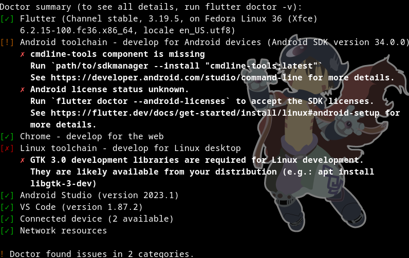

## Setup Flutter on your machine

Here's the **step by step** guide to setup **Flutter SDK** and **Android SDK**, as well as an **Android emulator**. You can find a more in depths guide **[here](https://docs.flutter.dev/get-started/install/linux/android)**.
If you do not have a Linux OS, please follow the guide for your own at [this page](https://docs.flutter.dev/get-started/install).

Assuming you are using a Linux OS, you can set it up like so:

### 1. Mandatory files
- Make sure those packages are installed on your machine: **curl**, **git**, **unzip**, **xz-utils**, **zip**, **libglu1-mesa**<br/>
(if you're using the OS version given by EPITECH, they are already installed)
```sh
sudo apt-get update -y && sudo apt-get upgrade -y;
sudo apt-get install -y curl git unzip xz-utils zip libglu1-mesa
```

### 2. Install Flutter
- Go to the tab **Download and install**
<br/>
<br/>
<br/>
- Then click the download button to install Flutter zipped file.<br/>
- Create a folder where you can install Flutter, best place to do it is `/usr/bin/`
- Extract the file into the directory with the following command:
```sh
sudo tar -xf ~/Downloads/flutter_linux_3.19.5-stable.tar.xz -C /usr/bin/
```
- Add the folder to your **env**.
```sh
For bash:
echo 'export PATH="/usr/bin/flutter/bin:$PATH"' >> ~/.bash_profile
```
```sh
For zsh:
echo 'export PATH="/usr/bin/flutter/bin:$PATH"' >> ~/.zshenv
```
- Then type this command to reload you terminal, or close it and open it again
```sh
source ~/.bash_profile
Or
source ~/.zshenv
```
- To check if Flutter was correctly installed, type this command in your terminal:
```sh
flutter doctor
```
- There will be errors but we only care about the fact that **Flutter**, **Android Toolchain** and **VS Code** are okay. For now, **Android Toolchain** is not setup yet. It should display you something similar to that:
<br/>
<br/>


### 3. Setup Android SDK
- To develop Android apps, we first need to setup the **Android SDK**. We will need to install **Android Studio** for that.
- Go to [this page](https://developer.android.com/studio) and click **Download Android Studio Iguana**.
- Extract the file like you did for **Flutter SDK** in the previous part.
```sh
sudo tar -xf ~/Downloads/android-studio-2023.2.1.24-linux.tar.gz -C /usr/bin/
```
- You can add the path to the **env**.
```sh
For bash:
echo 'export PATH="/usr/bin/android-studio/bin:$PATH"' >> ~/.bash_profile
```
```sh
For zsh:
echo 'export PATH="/usr/bin/android-studio/bin:$PATH"' >> ~/.zshenv
```
- Launch **Android Studio** with the following command:
```sh
studio.sh
Or
/usr/bin/android-studio/bin/studio.sh
```
- Follow the steps given by the **Setup Wizard**, you should install the following components:
    * **Android SDK Platform, API 34.0.0**
    * **Android SDK Command-line Tools**
    * **Android SDK Build-Tools**
    * **Android SDK Platform-Tools**
    * **Android Emulator**
- When you'll be in the main page, go to `Plugins` and install `Flutter` and `Dart`, and **restart Android Studio**
- Now, in the main page, click on `More Actions` and select `SDK Manager`
- Select the `SDK Tools` tab and check the `Android SDK Command-line Tools (latest)` line, then click on the install icon next to it and click `Apply`
<br/>
<br/>

<br/>
- On a terminal, check if the **Command-line Tools** installed correctly by running
```sh
flutter doctor
```
- You should see something like this now:
<br/>
<br/>

<br/>
- Now you just have to accept the license by running the following command, and accepting everything.
```sh
flutter doctor --android-licenses
```
- Run `flutter doctor` again and **Android Toolchain** should be green!

### 4. Setup Android Device

- You will need to have access to an Android device for testing purposes.
- Go on [this page](https://docs.flutter.dev/get-started/install/linux/android?tab=virtual#set-up-the-android-emulator) and follow the steps to create **an emulator** for an Android device. You can also go on [this page](https://docs.flutter.dev/get-started/install/linux/android?tab=physical#set-up-the-android-emulator) if you want to use **your own** Android device to test your project.
- Everything should be ready for you to start creating a **Flutter app**! You can now start the [workshop](./REAME.md)!

### (Optional) 5. Setup Flutter for VS Code
- In **VS Code**, open the **Command Palette** with `CTRL + Shift + P`, then type `flutter`.
- Select `Flutter: New Project`.<br/>
- At this point, you should have your **Flutter SDK** installed, so click `Locate SDK`. If you are prompted with `Which Flutter template?`, ignore it and press the `Esc` key.
- Follow [those steps](https://docs.flutter.dev/get-started/test-drive?tab=vscode#run-your-sample-flutter-app) to test your project with **VS Code** after starting the workshop
